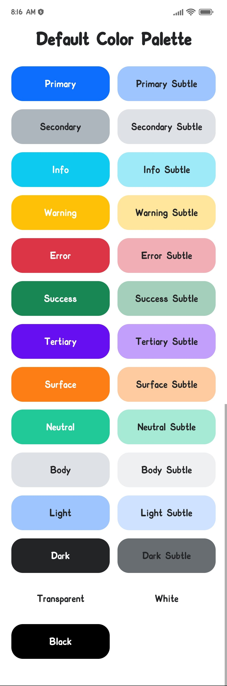
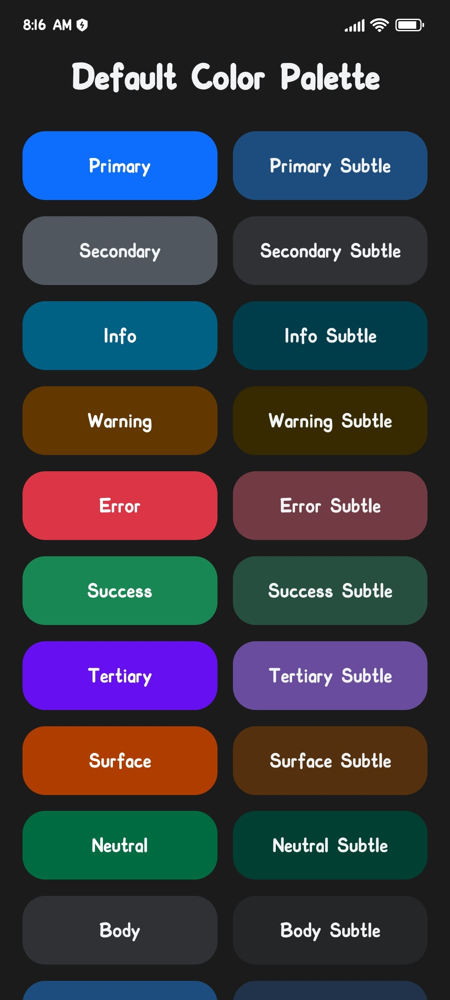

# ❄️ @blizzard-ui/theme

[](https://reactnative.dev)


[](https://github.com/your-username/blizzard-ui/theme/blob/main/LICENSE)

| Default Light Palette            | Default Dark Palette           |
| -------------------------------- | ------------------------------ |
|  |  |

## ✏️ Description

`@blizzard-ui/theme` is a React Native UI library that provides a flexible and customizable theme palette for your applications. It allows you to easily define and switch between `light`, `dark` & `system` color schemes, making it effortless to create visually appealing and consistent UI designs.

## ✨ Features

- Define and manage multiple color schemes.
- Famous CSS Library `bootstrap` like name scheming.
- Easily switch between color schemes at runtime.
- Customizable color palette and lots more.

## 📦 Installation

Install the library using npm:

```shell
npm install @blizzard-ui/theme
```

or with yarn:

```shell
yarn add @blizzard-ui/theme
```

## 🚀 Usage

Import the `@blizzard-ui/theme` in your project and Wrap your application with the `ThemeProvider` component:

```javascript
import { ThemeProvider } from '@blizzard-ui/theme';

export const App = (): JSX.Element => (
  <ThemeProvider>
    {/* Your App Components here */}
  </ThemeProvider>
);
```

Use the `useTheme` hook to access the current theme:

```javascript
import { useTheme } from '@blizzard-ui/theme';

export const Component = (): JSX.Element => {
  const { theme } = useTheme();

  return (
    <View style={{ backgroundColor: theme.colors.primary, flex: 1 }}>
      {/* Your other components here */}
    </View>
  );
};
```

You can change the default color palette with your own color palette:

```javascript
import { ThemeProvider } from '@blizzard-ui/theme';
import type { ThemePalette } from '@blizzard-ui/theme';

const myPalette: ThemePalette = { light: { primary: '#ecee81' }, dark: { primary: '#ebe76c' } };

export const App = (): JSX.Element => (
  <ThemeProvider userPalette={myPalette}>
    {/* Your App Components here */}
  </ThemeProvider>
);
```

## 💄 Color Palette

| Palette Code                   | Preview                                                        |
| ------------------------------ | -------------------------------------------------------------- |
| `theme.colors.primary`         |    |
| `theme.colors.primarySubtle`   |    |
| `theme.colors.secondary`       |    |
| `theme.colors.secondarySubtle` |    |
| `theme.colors.info`            |    |
| `theme.colors.infoSubtle`      |    |
| `theme.colors.warning`         |    |
| `theme.colors.warningSubtle`   |    |
| `theme.colors.error`           |    |
| `theme.colors.errorSubtle`     |    |
| `theme.colors.success`         |    |
| `theme.colors.successSubtle`   |    |
| `theme.colors.tertiary`        |    |
| `theme.colors.tertiarySubtle`  |    |
| `theme.colors.surface`         |    |
| `theme.colors.surfaceSubtle`   |    |
| `theme.colors.neutral`         |    |
| `theme.colors.neutralSubtle`   |    |
| `theme.colors.body`            |    |
| `theme.colors.bodySubtle`      |    |
| `theme.colors.light`           |    |
| `theme.colors.lightSubtle`     |    |
| `theme.colors.dark`            |    |
| `theme.colors.darkSubtle`      |    |
| `theme.colors.transparent`     |  |
| `theme.colors.white`           |    |
| `theme.colors.black`           |    |

## 💡 Example

For detailed implementation & example, you can check out [here](https://github.com/blizzard-ui/theme/tree/main/example).

## 📖 Documentation

For detailed documentation is coming soon.

## ✅ TODO

- [x] Add Dark Mode support.
- [ ] Add Detailed documentation.
- [ ] Add Themed Typography, Border Radiuses, Sizes, Shadows & Spaces.
- [ ] Add Library Testing cases.

## 🤝🏻 Contributing

Contributions are welcome! If you find a bug or want to suggest a new feature, please open an issue or submit a pull request. See the [contribution guidelines](https://github.com/blizzard-ui/theme/blob/main/CONTRIBUTING.md) for more details.

## 📃 License

This library is open source and available under the [MIT License](https://github.com/blizzard-ui/theme/blob/main/LICENSE).

---

Feel free to customize this library to fit your specific app and add any additional sections or information that you think would be relevant by create a pull request.
